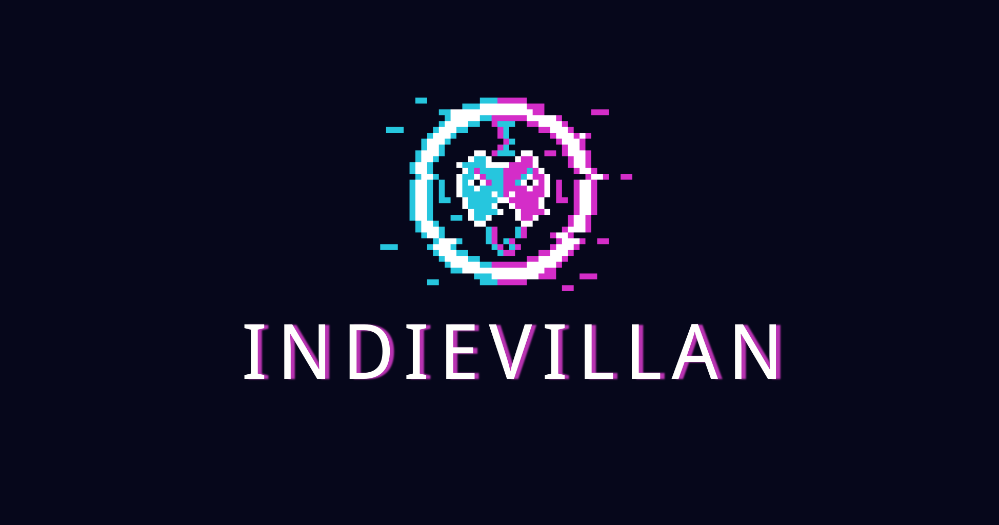

# Bem-vindo ao github da IndieVillan!

## Sobre nós
A IndieVillan nasceu da união de 6 amigos da faculdade, apaixonados por jogos e desenvolvimento. Decididos a transformar essa paixão em realidade e fundamos a empresa com um objetivo claro: criar jogos que divirtam e marquem a vida das pessoas.

Somos um time que acredita na colaboração, na criatividade e na busca constante por inovação. Nosso objetivo é continuar evoluindo, aprendendo com cada projeto e entregando jogos de alta qualidade que proporcionem experiências únicas para nossos jogadores.

Acompanhe nossa jornada e descubra o que a IndieVillain está preparando para o futuro!

### Nossas redes sociais

## Nossos Projetos

### Helva Echoes of a Lost Past
Helva é um RPG de mundo aberto em 2D top-down, desenvolvido em pixel art, que combina exploração, combate dinâmico e resolução de puzzles. Embora a visão principal do jogo seja top-down, Helva não se limita a esse estilo: em momentos específicos, a jogabilidade se transforma, introduzindo novas perspectivas e desafios.

O jogo oferece um combate livre, permitindo que os jogadores enfrentem inimigos de maneira estratégica, utilizando diferentes habilidades e estilos de luta dependendo do protagonista escolhido. Além do combate, os jogadores encontrarão diversos puzzles e desafios ambientais, que exigem raciocínio e interação com o mundo para serem superados.

Com um mundo vasto e interconectado, Helva incentiva a exploração, permitindo que cada jogador siga seu próprio caminho e descubra os mistérios do reino de maneira única. A ambientação medieval fantástica, aliada ao visual em pixel art detalhado, dá vida a um universo rico em história, criaturas e reinos cheios de segredos. 

### The UnderRat
The UnderRat é um jogo de ação no estilo SoulsLike em pixel art, onde você é jogado em meio a esgotos repletos de lixo e infestados de criaturas perigosas.

O jogador nasce no meio desse labirinto de possibilidades, como um pequeno e singelo ratinho, que em meio a essa situação, almeja ver como é o mundo além dos túneis. Entretanto, para isso, nosso pequeno protagonista precisa passar por diversos inimigos, derrotando líderes, abominações e ditadores terríveis dos esgotos nos mais diversos biomas, o que só é possível melhorando suas habilidades e usando da sucata e lixo presentes por todo lado, para construir e melhorar seus equipamentos, montando um arsenal, que será a chave para conseguir forjar sua saída desse mundo.
